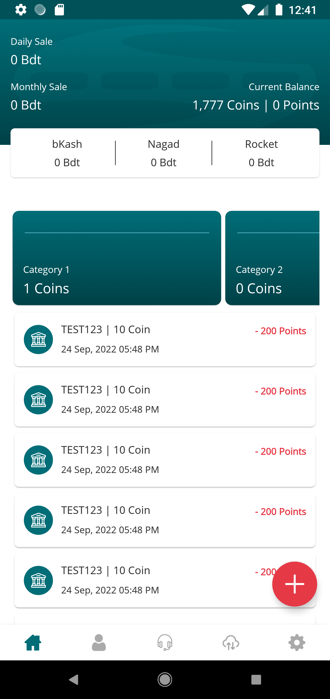
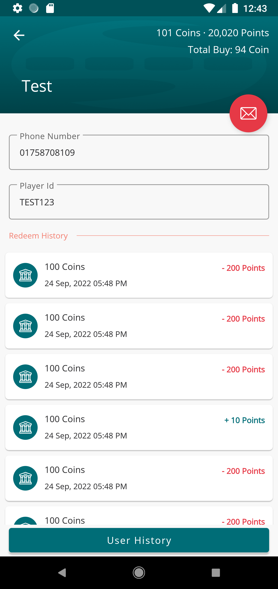
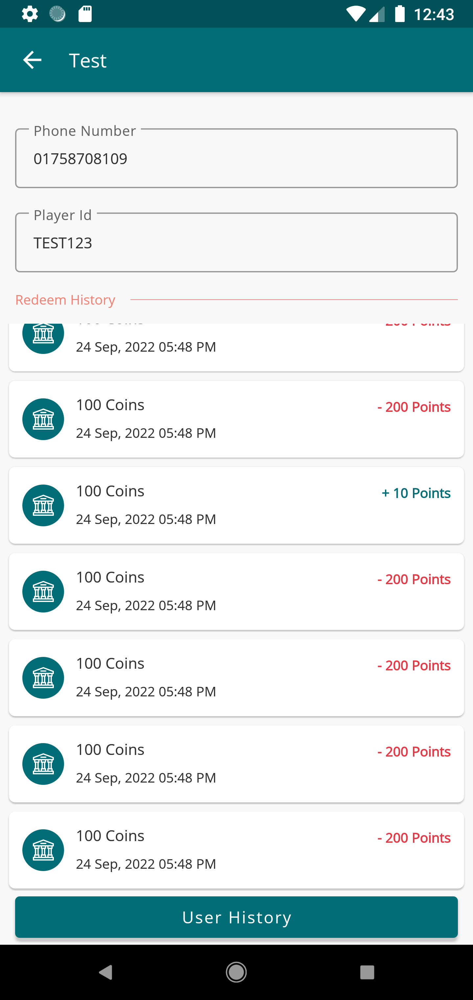

## Structure
- Model (for database, API and preferences)
- View (for UI logic, with DataBinding)
- ViewModel (for business logic)
- Workers (for background processing)
- Broadcast Service (for triggering specific services depending on user events)

## Dependencies
- Dependency injection (with [Hilt](http://google.github.io/hilt/))
- Google [Material Design](https://material.io/blog/android-material-theme-color) library
- Android architecture components to share ViewModels during configuration changes
- [Jetpack Navigation](https://developer.android.com/guide/navigation) for single activity design
- Kotlin Coroutines
- Room Database for offline capabilities
- Retrofit
- [Desugaring](https://developer.android.com/studio/write/java8-support-table) for Java 8 API support

## Screenshots

    
    
    

## Features
- Transaction identification from multiple [MFS](https://businesshaunt.com/mobile-financial-services-mfs-in-bangladesh/)
- Transaction validation
- Providing users with an option to verify their payment
- Insights on daily/monthly transactions
- Can be connected with any E-Commerce website
- Coroutines and Workers for handling CPU intensive tasks, creating smoother UX
- Capable of notifying users, update product prices
- Contains feature for referral system and more
