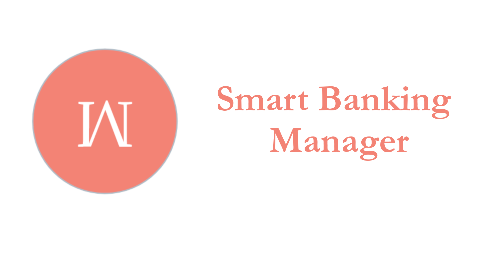

<!------>
 

  

  <h3 align="center">Smart Bank Manager</h3>

  

    Like your regular accounting application, just smarter
     
     
    <a href="https://github.com/Partha11/App-Releases/tree/master/BankAdmin/releases">View Demo</a>
    ·
    <a href="https://github.com/Partha11/App-Releases/issues">Report Bug</a>
    ·
    <a href="https://github.com/Partha11/App-Releases/issues">Request Feature</a>
  

## Structure
- Model (for database, API and preferences)
- View (for UI logic, with DataBinding)
- ViewModel (for business logic)
- Workers (for background processing)
- Broadcast Service (for triggering specific services depending on user events)

(<a href="#readme-top">back to top</a>)

### Built With

This application is developed using Kotlin. It uses a Laravel/Lumen backend for user information, which is accessed via REST APIs'. Firebase Authentication is used in this project for implementing some of the Firebase features, such as Realtime Database and Cloud Messaging.

* [![Kotlin][kotlin]][kotlin-url]
* [![Firebase][firebase]][firebase-url]
* [![PHP][php]][php-url]
* [![Lumen][lumen]][lumen-url]
* [![MySQL][mysql]][mysql-url]

(<a href="#readme-top">back to top</a>)

## Dependencies
- Dependency injection (with [Hilt](http://google.github.io/hilt/))
- Google [Material Design](https://material.io/blog/android-material-theme-color) library
- Android architecture components to share ViewModels during configuration changes
- [Jetpack Navigation](https://developer.android.com/guide/navigation) for single activity design
- Kotlin Coroutines
- Room Database for offline capabilities
- Retrofit
- [Desugaring](https://developer.android.com/studio/write/java8-support-table) for Java 8 API support

(<a href="#readme-top">back to top</a>)

### Screenshots

    
    
    

(<a href="#readme-top">back to top</a>)

## Features
- Transaction identification from multiple [Mobile Financial Services](https://businesshaunt.com/mobile-financial-services-mfs-in-bangladesh/)
- Transaction validation
- Providing users with an option to verify their payment
- Insights on daily/monthly transactions
- Can be connected with any E-Commerce website
- Coroutines and Workers for handling CPU intensive tasks, creating smoother UX
- Capable of notifying users, update product prices
- Contains feature for referral system
- Live chat feature for real time communication

(<a href="#readme-top">back to top</a>)

## To Do List

- [x] Add real time chat feature
- [x] Add pagination from database
- [x] Add databinding
    - [x] Update project structure to use single activity
- [ ] Update brand logo
- [ ] Add language support
    - [ ] Bangla
- [ ] Eliminate uses of string literal from viewmodel
- [ ] Add custom notification
    - [ ] Add feature for banner notification
    - [ ] Custom notification UI

(<a href="#readme-top">back to top</a>)

<!-- MARKDOWN LINKS & IMAGES -->
[kotlin]: https://img.shields.io/badge/kotlin-7F52FF?style=for-the-badge&logo=kotlin&logoColor=white
[kotlin-url]: https://kotlinlang.org/
[java]: https://img.shields.io/badge/java-F78C40?style=for-the-badge&logo=openjdk&logoColor=white
[java-url]: https://www.java.com/en/
[php]: https://img.shields.io/badge/php-777BB4?style=for-the-badge&logo=php&logoColor=white
[php-url]: https://www.php.net/
[firebase]: https://img.shields.io/badge/firebase-FFCA28?style=for-the-badge&logo=firebase&logoColor=white
[firebase-url]: https://firebase.google.com/
[mysql]: https://img.shields.io/badge/mysql-4479A1?style=for-the-badge&logo=mysql&logoColor=white
[mysql-url]: https://img.shields.io/badge/mysql-4479A1?style=for-the-badge&logo=mysql&logoColor=white
[lumen]: https://img.shields.io/badge/lumen-E74430?style=for-the-badge&logo=lumen&logoColor=white
[lumen-url]: https://lumen.laravel.com
