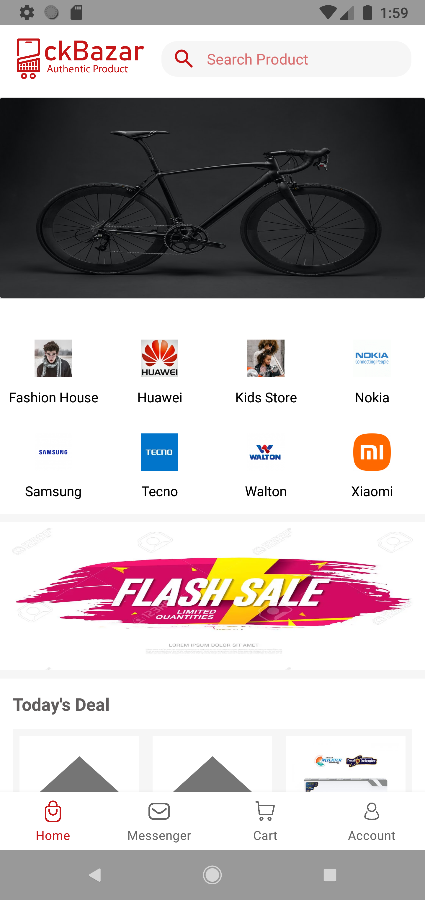
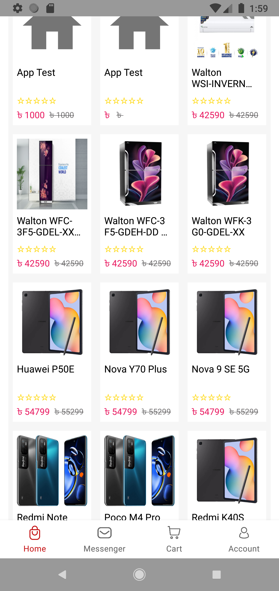
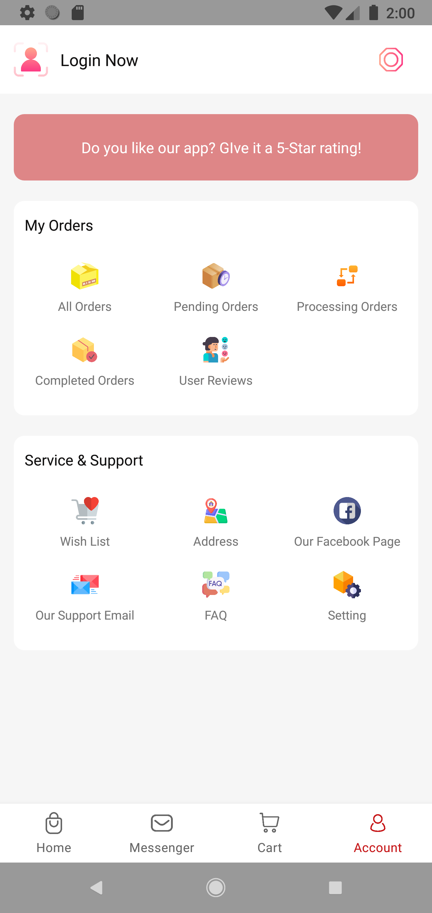
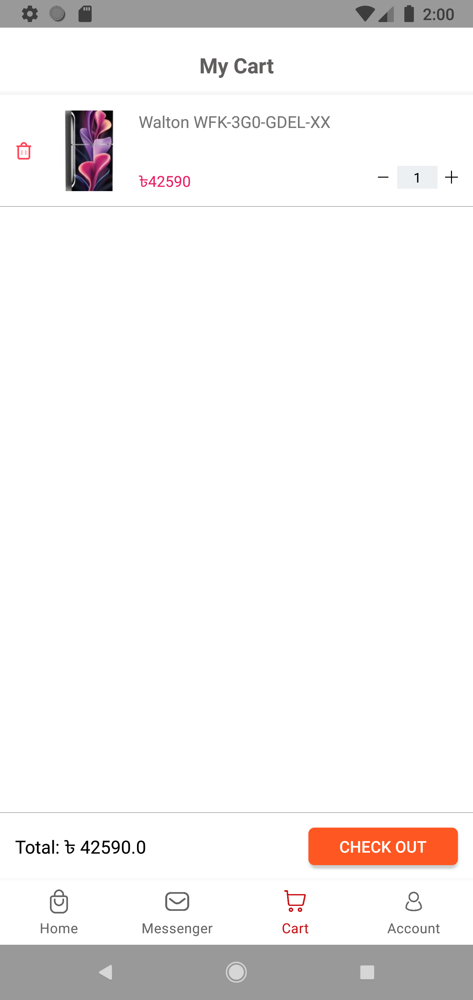

 

  

  <h3 align="center">CKBazar E-Commerce</h3>

  

    Just another e-commerce application
     
     
    <a href="https://github.com/Partha11/App-Releases/CKBazar/releases">View Demo</a>
    ·
    <a href="https://github.com/Partha11/App-Releases/issues">Report Bug</a>
    ·
    <a href="https://github.com/Partha11/App-Releases/issues">Request Feature</a>
  

### Structure
- Model (for database, API and preferences)
- View (for UI logic, with DataBinding)
- ViewModel (for business logic)
- Workers (for background processing)
- Broadcast Service (for triggering specific services depending on user events)

(<a href="#readme-top">back to top</a>)

### Built With

This application was developed using Java. Currently this project is being migrated to Kotlin for future support and better optimization. It uses the Wordpress API with it's own custom authentication system. As Wordpress don't jave support for multivendor sites, this is achieved using some custom coding and integreting a custom auth system which involves Firebase Auth.

* [![Java][java]][java-url]
* [![Kotlin][kotlin]][kotlin-url]
* [![Firebase][firebase]][firebase-url]
* [![PHP][php]][php-url]
* [![Wordpress][wordpress]][wordpress-url]
* [![MySQL][mysql]][mysql-url]

(<a href="#readme-top">back to top</a>)

### Dependencies
- Dependency injection (with [Hilt](http://google.github.io/hilt/))
- Google [Material Design](https://material.io/blog/android-material-theme-color) library
- Android architecture components to share ViewModels during configuration changes
- [Jetpack Navigation](https://developer.android.com/guide/navigation) for single activity design
- Kotlin Coroutines
- Room Database for offline capabilities
- Retrofit
- [RxJava](https://github.com/ReactiveX/RxJava/tree/2.x) for reactive programming
- [Desugaring](https://developer.android.com/studio/write/java8-support-table) for Java 8 API support

(<a href="#readme-top">back to top</a>)

### Screenshots

    
    
    

    

(<a href="#readme-top">back to top</a>)

## Features
- Multivendor E-Commerce application created by using wordpress backend API
- Custom auth system for integrating Firebase Auth with Wordpress
- RxPaging for paginating data from server
- Coroutine Workers for background processing
- Separate application for vendor and product management

(<a href="#readme-top">back to top</a>)

## To Do List

- [x] Add workmanager-ktx artifact
- [x] Migrate to paging 3
- [ ] Migrate whole project to kotlin
- [ ] Add databinding
    - [ ] Change project structure to use single activity
    - [ ] Create viewmodels for each fragment with their own lifecycle
- [x] Update brand logo
- [x] Add language support
    - [x] Bangla

(<a href="#readme-top">back to top</a>)

<!-- MARKDOWN LINKS & IMAGES -->
[kotlin]: https://img.shields.io/badge/kotlin-7F52FF?style=for-the-badge&logo=kotlin&logoColor=white
[kotlin-url]: https://kotlinlang.org/
[java]: https://img.shields.io/badge/java-F78C40?style=for-the-badge&logo=openjdk&logoColor=white
[java-url]: https://www.java.com/en/
[wordpress]: https://img.shields.io/badge/wordpress-21759B?style=for-the-badge&logo=wordpress&logoColor=white
[wordpress-url]: https://wordpress.org
[php]: https://img.shields.io/badge/php-777BB4?style=for-the-badge&logo=php&logoColor=white
[php-url]: https://www.php.net/
[firebase]: https://img.shields.io/badge/firebase-FFCA28?style=for-the-badge&logo=firebase&logoColor=white
[firebase-url]: https://firebase.google.com/
[mysql]: https://img.shields.io/badge/mysql-4479A1?style=for-the-badge&logo=mysql&logoColor=white
[mysql-url]: https://img.shields.io/badge/mysql-4479A1?style=for-the-badge&logo=mysql&logoColor=white
